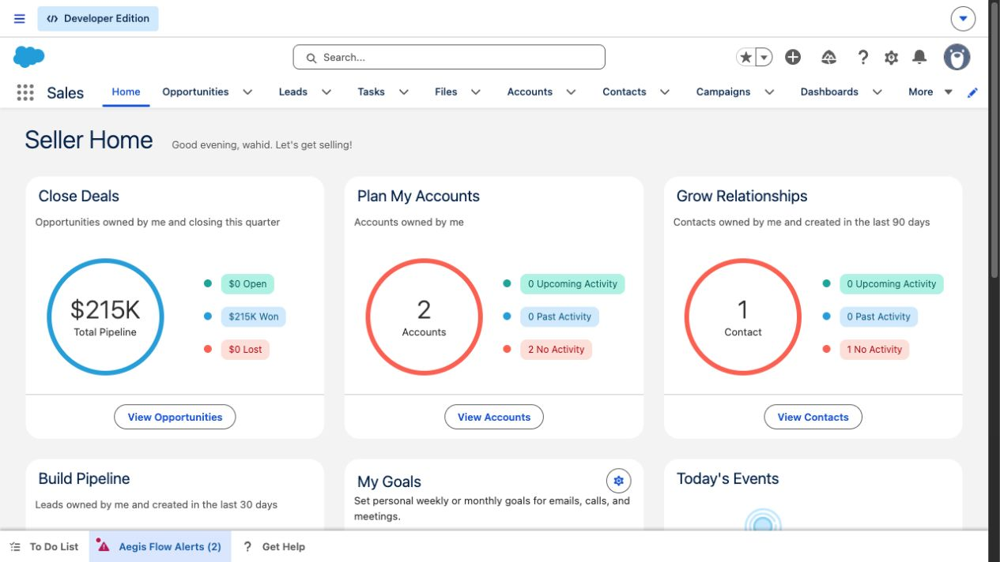
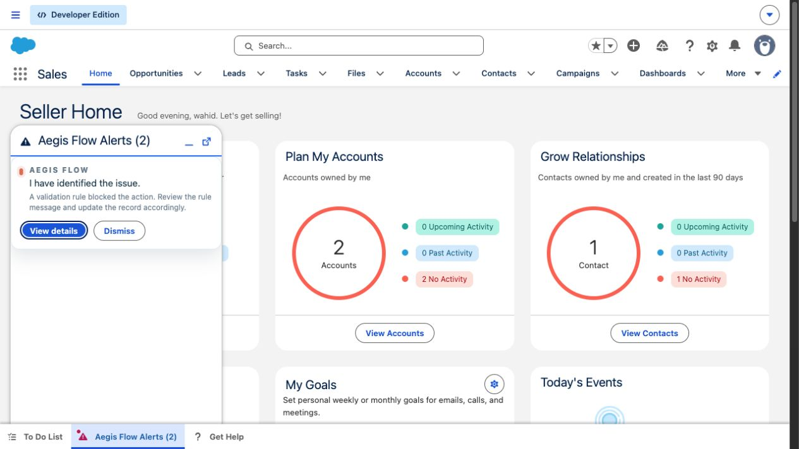
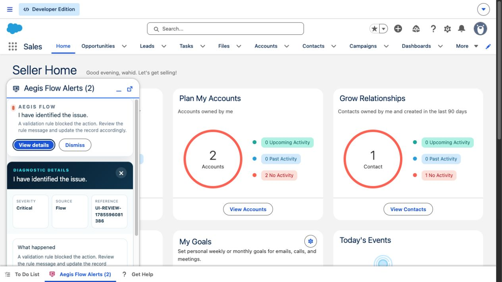
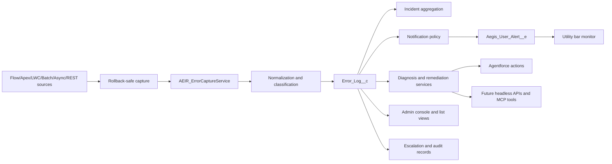

# Aegis Flow Headless Technical Document

**Version:** Sprint 2 working draft
**Last updated:** 2026-08-01
**Primary org used for validation:** `Aegis Flow_WA_Dev`

## 1. Purpose

Aegis Flow is a Salesforce-native diagnostic and response layer for automation failures, user-facing Flow failures, Apex failures, async failures, batch failures, custom LWC errors, and explicit integration diagnostics. The current utility bar experience is one delivery surface. The product direction is broader: Aegis Flow should behave as a headless diagnostic platform that can serve Lightning utility bars, Agentforce actions, MCP tools, APIs, admin consoles, and external operations surfaces from the same governed incident model.

## 2. Screenshots

The current org validation shows the Aegis utility bar highlighted when open alerts exist:

The proactive utility panel opens with a plain-language diagnosis for the affected user:

The detail panel exposes the diagnostic metadata and escalation controls:

## 3. Technical Summary

Aegis Flow captures platform and application failures, normalizes them into `Error_Log__c`, groups repeated failures into incidents, applies a notification policy, and exposes diagnostic actions through Salesforce UI and automation entry points.

The most important design decision is rollback-safe capture. When a Flow or Apex transaction fails and rolls back, direct DML cannot be trusted to persist diagnostics. Aegis uses platform events for rollback-safe paths, then downstream subscribers create durable logs, notifications, incident records, escalation records, and optional remediation/retry records.

## 4. Headless Architecture

The utility bar should be treated as a subscriber to Aegis Flow, not as the product boundary. The same normalized diagnostic contract can be called by an LWC, Agentforce, an MCP server, an external support console, or a customer-owned integration.

## 5. Capture Sources

| Source | Current implementation | Speed | Record context | Notes |
| --- | --- | --- | --- | --- |
| Record-triggered Flow fault, browser open | `FlowExecutionErrorEvent` streamed to `aegisHeadlessMonitor`, then `AEIR_AegisHeadlessMonitorController.captureFlowError()` | Seconds | Yes, when provided by event | Browser-dependent because this Salesforce event is not triggerable in Apex. |
| Flow fault path | `AEIR_CaptureFlowFaultAction` publishes `Error_Captured__e` | Seconds | Yes | Best pattern for business-critical customer Flows. |
| Failed Flow interview polling | `AEIR_FlowInterviewMonitor` reconciles failed interviews | Testing cadence: up to 5 minutes. Normal cadence: up to 15 minutes. | No | Works without browser session, but the platform does not expose full record context. |
| Apex exception | `AEIR_Guard.capture()` or `AEIR_ErrorCaptureService.capture()` | Seconds | Yes, when caller passes it | Use publish-based capture when the caller will rethrow. |
| Batch Apex | `BatchApexErrorEvent` trigger and handler | Seconds | Usually no | Batch classes must implement `Database.RaisesPlatformEvents`. |
| Failed async job | `AEIR_AsyncJobMonitorScheduler` | Scheduled | No | Polling path for failed async jobs where no event is available. |
| Custom LWC error | `errorBoundaryWrapper` and `AEIR_ClientErrorController` | Seconds | Page/client context | Best for custom forms and user-facing component failures. |
| Integration/API diagnostic | `AEIR_InboundDiagnosticRestService` | Seconds | Caller-provided | Requires authenticated caller and scoped permission. |
| Manual "Get Help" | `helpMeAgentUtility` and `AEIR_HelpMeController` | User initiated | Page context | For user confusion or cases where no platform exception is emitted. |

## 6. Core Services And Methods

| Area | Main classes | Responsibility |
| --- | --- | --- |
| Capture | `AEIR_ErrorCaptureService`, `AEIR_CaptureFlowFaultAction`, `AEIR_Guard`, `AEIR_ClientErrorController`, `AEIR_InboundDiagnosticRestService` | Convert source-specific failures into normalized capture requests. |
| Flow monitoring | `AEIR_AegisHeadlessMonitorController.captureFlowError`, `AEIR_FlowInterviewMonitor`, `AEIR_FlowCoverageService` | Capture real-time Flow events, reconcile failed interviews, and detect Flows that lack fault coverage. |
| Notification | `AEIR_UserNotificationService`, `AEIR_NotificationPolicyService`, `aegisHeadlessMonitor` | Create user notifications, apply policy thresholds, update utility labels/highlights, and open the utility when policy allows. |
| Diagnosis | `AEIR_ErrorNormalizationService`, `AEIR_AgentforceGatewayService`, `AEIR_InvokeDiagnosisAction` | Classify known failure patterns and store deterministic or agent-generated diagnosis records. |
| Incidents | `AEIR_IncidentAggregationService` | Group repeated failures by incident key and time bucket. |
| Escalation | `AEIR_EscalationService`, `AEIR_CreateEscalationAction`, `developerEscalationViewer` | Create sanitized developer packages and delivery audit records. |
| Remediation | `AEIR_RemediationOrchestrator`, `AEIR_ExecuteRemediationAction`, `Remediation_Action_Setting__mdt` | Execute approved, metadata-whitelisted remediation actions. |
| Retry | `AEIR_RetryOrchestrationService`, `AEIR_RetryHandler`, `Retry_Handler__mdt`, `Retry_Attempt__c` | Queue and execute approved retry patterns. |
| Setup and health | `aegisSetupWizard`, `AEIR_OrgSetupService`, `AEIR_SetupHealthCheckService` | Configure routing, run health checks, and report Flow coverage gaps. |
| Retention | `AEIR_RetentionScheduler`, `AEIR_RetentionPurgeBatch`, `Retention_Policy__mdt` | Delete or redact old diagnostic data based on policy. |

## 7. Data Model

| Object or metadata type | Purpose |
| --- | --- |
| `Error_Log__c` | Primary durable failure record. |
| `Error_Context__c` | Structured technical context attached to an error. |
| `Incident__c` | Grouped incident for repeated failures. |
| `User_Notification__c` | Alert state for affected users/admins. |
| `AI_Diagnosis__c` | Stored diagnosis, confidence, recommended action, and summary. |
| `Diagnostic_Session__c` | Manual help session or user-requested diagnostic workflow. |
| `Developer_Escalation__c` | Sanitized escalation package. |
| `Delivery_Audit__c` | Delivery and escalation audit trail. |
| `Remediation_Action__c` | Execution record for approved remediation. |
| `Retry_Attempt__c` | Retry request and execution status. |
| `Error_Feedback__c` | User/admin feedback on a diagnosis or outcome. |
| `Error_Attachment__c` | Optional attachment metadata for diagnostic evidence. |
| `Notification_Policy__mdt` | Governs alert eligibility, auto-open, cooldown, grouping, and admin/user routing. |
| `Error_Rule__mdt` | Deterministic classification rules. |
| `Retention_Policy__mdt` | Diagnostic retention and purge policy. |
| `Sensitive_Field__mdt` | Fields that must be masked or excluded from outbound payloads. |
| `Remediation_Action_Setting__mdt` | Whitelisted remediation actions and object/field boundaries. |
| `Retry_Handler__mdt` | Retry handler routing and enabled status. |

## 8. Platform Events

| Event | Role |
| --- | --- |
| `Error_Captured__e` | Rollback-safe custom capture event. Published by Flow fault paths and Apex guard flows. |
| `Aegis_User_Alert__e` | User/admin alert event consumed by the utility bar. |
| `Agent_Diagnosis_Requested__e` | Requests asynchronous diagnosis processing. |
| `Diagnostic_Session_Requested__e` | Starts manual or guided diagnostic sessions. |
| `Escalation_Requested__e` | Requests developer escalation processing. |
| `BatchApexErrorEvent` | Salesforce standard event for failed batch chunks when the batch opts in. |
| `FlowExecutionErrorEvent` | Salesforce standard streaming-only event consumed by the browser-side utility monitor. |

Important platform constraint: `FlowExecutionErrorEvent` is not Apex-triggerable and is not used as a durable server-side trigger source. Aegis captures it through the utility bar while a user is in a Lightning app that includes the monitor.

## 9. Notification And Utility Behavior

The deployed default notification policy is `Notification_Policy.DEFAULT`.

| Setting | Current value |
| --- | --- |
| Active | `true` |
| Notify affected user | `true` |
| Notify admin | `true` |
| Auto open utility | `true` |
| Minimum severity | `Medium` |
| Critical mode | `Notify Both` |
| Cooldown | `15` minutes |
| Max alerts per hour | `3` |
| Minimum confidence | `60` |
| Grouping key | `IncidentKey` |

The `aegisHeadlessMonitor` LWC is hosted in Lightning utility bars with label `Aegis Flow Alerts`, icon `screen`, width `340`, height `480`, eager loading enabled, and scrolling enabled. It uses `lightning/platformUtilityBarApi` to update the utility label, highlight the utility item, and open the panel when `Auto_Open_Utility__c` allows it.

## 10. Security Model

Aegis Flow is designed around least-privilege diagnostics:

- Permission sets separate end-user, product admin, support analyst, developer viewer, integration user, and sample remediation access.
- Raw platform event payloads and browser context are treated as untrusted input.
- Sensitive data is masked through `AEIR_SecuritySanitizerService` and `Sensitive_Field__mdt`.
- Remediation is metadata-whitelisted and rechecks CRUD/FLS before writing records.
- Escalation packages are sanitized before they are sent to developer/support recipients.
- The REST diagnostic endpoint requires an authenticated caller and should be assigned only to an integration user or other explicit technical identity.
- Alert events carry user-safe summaries. Detailed diagnostic data remains in governed Salesforce records.

## 11. Covered Scenarios

| Scenario | Covered now | Expected result |
| --- | --- | --- |
| Flow trips a validation rule and faults while utility is open | Yes | Utility highlights/opens and shows validation-rule diagnosis. |
| Flow fault path calls Aegis capture action | Yes | Durable error log is created in seconds with record context. |
| Flow fails without a fault path and no browser is open | Yes, delayed | Poller detects failed interview; record context may be missing. |
| Apex DML exception wrapped with Aegis guard | Yes | Durable error log, incident grouping, and alert routing. |
| Batch Apex failure with platform event opt-in | Yes | Batch failure is logged through standard batch error event handling. |
| Failed async job | Yes | Scheduled monitor creates the diagnostic record. |
| Custom LWC component exception | Yes | Client error is captured through the wrapper/controller. |
| Integration or external diagnostic post | Yes | REST service records caller-provided diagnostic context. |
| User confusion without a platform exception | Yes | User can open Get Help and create a diagnostic session. |
| Direct standard page validation-rule save | No | Salesforce blocks the save before Aegis receives a platform automation failure. |
| Direct duplicate-rule save | No | Expected platform boundary; not captured unless wrapped by automation/custom code. |
| Lead Convert validation failure | No | Expected platform boundary; use custom instrumentation if required. |
| Real Agentforce callout | Deferred | Current product stores deterministic/contract-ready diagnosis; live Agentforce integration remains Phase 2. |
| Namespace and second-generation managed package readiness | Deferred | Tracked separately in namespace readiness work. |

## 12. Phase 2: Aegis Flow Headless Line Items

Phase 2 should make the headless model explicit. The Lightning utility should remain a polished surface, but not the only way to consume Aegis.

| Line item | Goal | Notes |
| --- | --- | --- |
| Headless product contract | Define Aegis Flow as a diagnostic service layer with UI, agent, and API clients. | Use stable logical keys, not namespaced API names, in external payloads. |
| Diagnostic API facade | Add Apex service methods that return current errors, incident summaries, notification state, and recommended next actions. | Keep payloads sanitized and permission-checked. |
| MCP server toolset | Expose tools such as `find_recent_errors`, `get_error_context`, `list_incidents`, `dismiss_notification`, `create_escalation`, `run_health_check`, and `scan_flow_coverage`. | This makes Aegis usable by Codex, Claude Code, internal agents, and support copilots. |
| Agentforce action package | Package the current invocable actions as governed agent actions once real Agentforce callout configuration is enabled. | Preserve deterministic fallback when the model/action is unavailable. |
| External operations channels | Add optional Slack, Teams, webhook, or customer support console subscribers. | These should subscribe through governed server-side services, not raw event payloads. |
| Headless auth model | Define Connected App, integration permission set, IP/session rules, and per-tool scopes. | Avoid broad admin tokens for diagnostic clients. |
| API observability | Add delivery audits, request ids, usage counts, and failure logs for headless consumers. | Required before customer-facing headless rollout. |
| Packaging boundary | Complete namespace and 2GP review before managed package creation. | Keep namespace readiness deferred until the package org path is chosen. |
| Demo scenario | Build a demo where an agent asks, "Why did this Order Flow fail?" and Aegis returns the incident, rule cause, affected record, and safe next step. | Utility bar remains optional; headless response is the product proof. |

## 13. Validation Evidence

Current validation evidence for this working branch:

- LWC unit tests: `npm run test:unit` passed 18 of 18 tests.
- Local audit: `python3 scripts/local_audit.py` passed after current sprint fixes.
- Focused Apex regression during the sprint passed 15 of 15 specified tests.
- Utility bar metadata deploy succeeded in the target org.
- `Notification_Policy.DEFAULT.Auto_Open_Utility__c` is deployed as `true`.
- Browser validation confirmed the utility highlighted as `Aegis Flow Alerts (2)`, opened with the proactive validation-rule diagnosis, and exposed diagnostic details and escalation controls.

## 14. Known Deferred Work

- Namespace readiness and second-generation managed package creation.
- Live Agentforce callout configuration and real action execution.
- Marketplace/AppExchange collateral and go-to-market packaging.
- Direct standard page validation-rule and duplicate-rule capture, which remains a Salesforce platform boundary unless the customer uses custom forms, Flow fault paths, Apex wrappers, or browser-assisted manual diagnostics.
