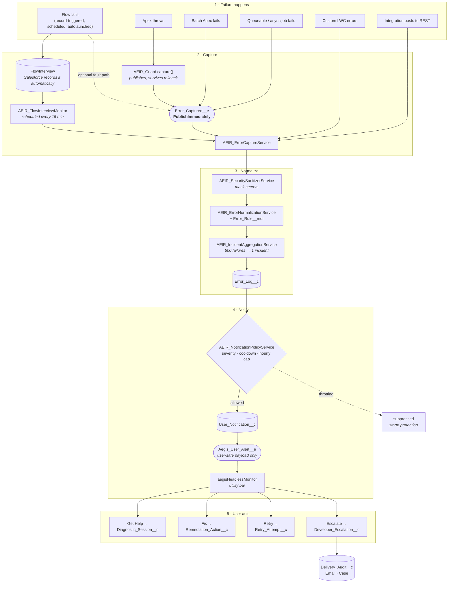
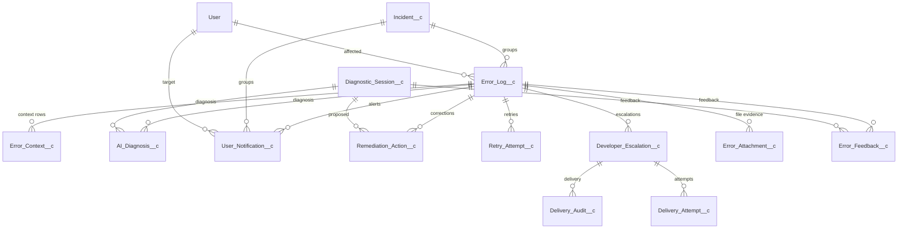

# Aegis Flow — Data Model and Process Flow

**Generated:** 2026-07-29 from `force-app/main/default/objects` (API 67.0)  
**Objects:** 31 — 13 custom objects, 5 platform events, 12 metadata types, 1 custom setting

> Generated from metadata by `scripts/generate_data_model_doc.py`. Regenerate rather than editing by hand; narrative sections live in that script.

---

## 1. End-to-end process flow

### Capture paths, and what each costs

| Source | Path | Instrumentation needed | Latency |
|---|---|---|---|
| Flow (any type) | `FlowInterview` → monitor | **None** | ≤ 15 min |
| Flow (critical) | Fault path → `Error_Captured__e` | Fault connector per Flow | Immediate |
| Apex | `AEIR_Guard.capture()` | One line in `catch` | Immediate |
| Batch Apex | `BatchApexErrorEvent` trigger | `Database.RaisesPlatformEvents` | Immediate |
| Queueable | `AEIR_QueueableFinalizer` | `System.attachFinalizer()` | Immediate |
| Async jobs | `AEIR_AsyncJobMonitorScheduler` | **None** | ≤ 1 hour |
| Custom LWC | `errorBoundaryWrapper` | Wrap component | Immediate |
| Integration | REST endpoint | Caller posts | Immediate |

> **Not capturable:** a validation rule blocking a direct save or a Lead Convert. The platform rejects those before any Apex or Flow can observe them.

---

## 2. Object relationships

Every record also carries `Correlation_Id__c`, which ties one failure together across all objects and is the reference number shown to the user.

---

## 3. Objects and fields

### Evidence and Diagnosis

Records the failure and what we concluded about it.

#### `Error_Log__c` — Error Log

Custom Object · sharing: **Private**  

| Field | Label | Type | Notes |
|---|---|---|---|
| `Action_Name__c` | Action Name | Text(255) | - |
| `Agentforce_Status__c` | Agentforce Status | Picklist | Values: Not Invoked, Invoked, Failed, Completed, Mocked, Deterministic Fallback |
| `Async_Job_Id__c` | Async Job Id | Text(18) | - |
| `Changed_Fields_JSON__c` | Changed Fields JSON | LongTextArea(32768) | - |
| `Context_JSON__c` | Context JSON | LongTextArea(131072) | - |
| `Correlation_Id__c` | Correlation Id | Text(80) | **external id; unique** |
| `Debug_Log_Id__c` | Debug Log Id | Text(18) | - |
| `Debug_Log_Link__c` | Debug Log Link | Url | - |
| `Error_Category__c` | Error Category | Picklist | Values: Missing Data, Validation Rule, Permission, Governor Limit, Null Pointer, Integration, Locking, Configuration, Code Defect, Automation Failure, Unknown |
| `Error_Type__c` | Error Type | Picklist | Values: Apex, Flow, LWC, Batch, Queueable, Integration, API, Validation, Permission, Unknown |
| `First_Seen_At__c` | First Seen At | DateTime | - |
| `Incident_Key__c` | Incident Key | Text(255) | **external id** |
| `Incident__c` | Incident | Lookup | **→ Incident__c** |
| `Last_Seen_At__c` | Last Seen At | DateTime | - |
| `Normalized_Message__c` | Normalized Message | LongTextArea(32768) | - |
| `Object_API_Name__c` | Object API Name | Text(100) | - |
| `Original_Error_Message__c` | Original Error Message | LongTextArea(32768) | - |
| `Page_Reference_JSON__c` | Page Reference JSON | LongTextArea(32768) | - |
| `Page_URL__c` | Page URL | LongTextArea(32768) | - |
| `Record_Id__c` | Record Id | Text(18) | - |
| `Related_Diagnostic_Session__c` | Related Diagnostic Session | Lookup | **→ Diagnostic_Session__c** |
| `Retry_Eligible__c` | Retry Eligible | Checkbox | - |
| `Severity__c` | Severity | Picklist | Values: Low, Medium, High, Critical |
| `Source_Name__c` | Source Name | Text(255) | - |
| `Source_Type__c` | Source Type | Picklist | Values: Flow, Apex Class, Trigger, LWC, Batch, Queueable, API, External Service, Manual, Unknown |
| `Stack_Trace__c` | Stack Trace | LongTextArea(32768) | - |
| `Status__c` | Status | Picklist | Values: New, Diagnosed, Pending User Input, Resolved, Escalated, Retry Scheduled, Closed, Suppressed |
| `User__c` | User | Lookup | **→ User** |

#### `Error_Context__c` — Error Context

Custom Object · sharing: **Private**  

| Field | Label | Type | Notes |
|---|---|---|---|
| `Context_Type__c` | Context Type | Picklist | Values: Page, Record Snapshot, Changed Fields, Payload, User Steps, Log Snippet, Related Record, Browser, Agent Payload |
| `Correlation_Id__c` | Correlation Id | Text(80) | **external id** |
| `Error_Log__c` | Error Log | Lookup | **→ Error_Log__c** |
| `Masked__c` | Masked | Checkbox | - |
| `Payload_JSON__c` | Payload JSON | LongTextArea(131072) | - |
| `Sequence__c` | Sequence | Number | - |
| `Source__c` | Source | Text(255) | - |

#### `Incident__c` — Incident

Custom Object · sharing: **Private**  

| Field | Label | Type | Notes |
|---|---|---|---|
| `Affected_Record_Count__c` | Affected Record Count | Number | - |
| `Affected_User_Count__c` | Affected User Count | Number | - |
| `Failed_Element__c` | Failed Element | Text(255) | - |
| `First_Seen_At__c` | First Seen At | DateTime | - |
| `Highest_Severity__c` | Highest Severity | Picklist | Values: Low, Medium, High, Critical |
| `Incident_Key__c` | Incident Key | Text(255) | **external id** |
| `Last_Seen_At__c` | Last Seen At | DateTime | - |
| `Normalized_Category__c` | Normalized Category | Text(255) | - |
| `Occurrence_Count__c` | Occurrence Count | Number | - |
| `Source_Name__c` | Source Name | Text(255) | - |
| `Source_Type__c` | Source Type | Text(80) | - |
| `Status__c` | Status | Picklist | Values: Open, Monitoring, Resolved, Known Issue, Suppressed |
| `Summary__c` | Summary | LongTextArea(4000) | - |

#### `AI_Diagnosis__c` — AI Diagnosis

Custom Object · sharing: **Private**  

| Field | Label | Type | Notes |
|---|---|---|---|
| `Agent_Status__c` | Agent Status | Picklist | Values: Not Invoked, Invoked, Failed, Completed, Mocked, Deterministic Fallback |
| `Confidence__c` | Confidence | Percent | - |
| `Correlation_Id__c` | Correlation Id | Text(80) | **external id** |
| `Diagnostic_Session__c` | Diagnostic Session | Lookup | **→ Diagnostic_Session__c** |
| `Error_Log__c` | Error Log | Lookup | **→ Error_Log__c** |
| `Escalation_Required__c` | Escalation Required | Checkbox | - |
| `Fixability__c` | Fixability | Picklist | Values: USER_FIXABLE, ADMIN_FIXABLE, DEVELOPER_ONLY, RETRYABLE, UNKNOWN |
| `Input_Payload_JSON__c` | Input Payload JSON | LongTextArea(131072) | - |
| `Needs_User_Input__c` | Needs User Input | Checkbox | - |
| `Output_JSON__c` | Output JSON | LongTextArea(32768) | - |
| `Recommended_Action__c` | Recommended Action | LongTextArea(32768) | - |
| `Root_Cause__c` | Root Cause | LongTextArea(32768) | - |
| `Safe_Remediation_Action_Key__c` | Safe Remediation Action Key | Text(120) | - |
| `Summary__c` | Summary | LongTextArea(32768) | - |

#### `Error_Attachment__c` — Error Attachment

Custom Object · sharing: **Private**  

| Field | Label | Type | Notes |
|---|---|---|---|
| `Attachment_Type__c` | Attachment Type | Picklist | Values: Debug Log, Payload, Screenshot, Stack Trace, Other |
| `Content_Document_Id__c` | Content Document Id | Text(18) | - |
| `Error_Log__c` | Error Log | Lookup | **→ Error_Log__c** |
| `File_Name__c` | File Name | Text(255) | - |
| `Retention_Expires_At__c` | Retention Expires At | Date | - |
| `Sanitized__c` | Sanitized | Checkbox | - |

### User Assistance

Everything the affected user sees or contributes.

#### `User_Notification__c` — User Notification

Custom Object · sharing: **Private**  

| Field | Label | Type | Notes |
|---|---|---|---|
| `Action_Available__c` | Action Available | Picklist | Values: VIEW, HELP, RETRY, FIX, ESCALATE, NONE |
| `Correlation_Id__c` | Correlation Id | Text(80) | **external id** |
| `Dedupe_Key__c` | Dedupe Key | Text(255) | **external id** |
| `Dismissed_At__c` | Dismissed At | DateTime | - |
| `Error_Log__c` | Error Log | Lookup | **→ Error_Log__c** |
| `Expires_At__c` | Expires At | DateTime | - |
| `Headline__c` | Headline | Text(255) | - |
| `Incident__c` | Incident | Lookup | **→ Incident__c** |
| `Notification_Type__c` | Notification Type | Picklist | Values: Detected, Diagnosed, Retry Available, Escalated, Resolved |
| `Severity__c` | Severity | Picklist | Values: Low, Medium, High, Critical |
| `Short_Message__c` | Short Message | LongTextArea(4000) | - |
| `Source_Event_Replay_Id__c` | Source Event Replay Id | Text(80) | - |
| `Status__c` | Status | Picklist | Values: New, Viewed, Dismissed, Expired, Resolved |
| `Target_User__c` | Target User | Lookup | **→ User** |
| `Viewed_At__c` | Viewed At | DateTime | - |

#### `Diagnostic_Session__c` — Diagnostic Session

Custom Object · sharing: **Private**  

| Field | Label | Type | Notes |
|---|---|---|---|
| `Action_Name__c` | Action Name | Text(255) | - |
| `Agent_Response__c` | Agent Response | LongTextArea(32768) | - |
| `App_Name__c` | App Name | Text(120) | - |
| `Browser_Context_JSON__c` | Browser Context JSON | LongTextArea(32768) | - |
| `Context_Record_Id__c` | Context Record Id | Text(18) | - |
| `Correlation_Id__c` | Correlation Id | Text(80) | **external id** |
| `Created_From__c` | Created From | Picklist | Values: Help Me Utility, Automatic Capture, Flow, Apex, LWC, API, Platform Event |
| `Detected_Issue_Type__c` | Detected Issue Type | Picklist | Values: Save Error, Process Failed, Navigation Help, Data Question, Report Issue, Unknown |
| `Needs_Escalation__c` | Needs Escalation | Checkbox | - |
| `Object_API_Name__c` | Object API Name | Text(100) | - |
| `Page_Reference_JSON__c` | Page Reference JSON | LongTextArea(32768) | - |
| `Page_URL__c` | Page URL | LongTextArea(32768) | - |
| `Recent_Error_Log__c` | Recent Error Log | Lookup | **→ Error_Log__c** |
| `Resolution_Status__c` | Resolution Status | Picklist | Values: Open, Resolved, Escalated, Cancelled, Pending User |
| `User_Description__c` | User Description | LongTextArea(32768) | - |
| `User__c` | User | Lookup | **→ User** |

#### `Error_Feedback__c` — Error Feedback

Custom Object · sharing: **Private**  

| Field | Label | Type | Notes |
|---|---|---|---|
| `Comments__c` | Comments | LongTextArea(32768) | - |
| `Diagnostic_Session__c` | Diagnostic Session | Lookup | **→ Diagnostic_Session__c** |
| `Error_Log__c` | Error Log | Lookup | **→ Error_Log__c** |
| `Helpful__c` | Helpful | Checkbox | - |
| `Outcome__c` | Outcome | Picklist | Values: Useful, Not Useful, Resolved, Not Resolved, False Positive, Duplicate |
| `Submitted_By__c` | Submitted By | Lookup | **→ User** |

### Recovery

Corrective action, governed and audited.

#### `Remediation_Action__c` — Remediation Action

Custom Object · sharing: **Private**  

| Field | Label | Type | Notes |
|---|---|---|---|
| `Action_Key__c` | Action Key | Text(120) | - |
| `After_Value__c` | After Value | LongTextArea(32768) | - |
| `Approved_By__c` | Approved By | Lookup | **→ User** |
| `Before_Value__c` | Before Value | LongTextArea(32768) | - |
| `Correlation_Id__c` | Correlation Id | Text(80) | **external id** |
| `Diagnostic_Session__c` | Diagnostic Session | Lookup | **→ Diagnostic_Session__c** |
| `Error_Log__c` | Error Log | Lookup | **→ Error_Log__c** |
| `Executed_By__c` | Executed By | Lookup | **→ User** |
| `Field_API_Name__c` | Field API Name | Text(100) | - |
| `Object_API_Name__c` | Object API Name | Text(100) | - |
| `Requested_By__c` | Requested By | Lookup | **→ User** |
| `Requires_Confirmation__c` | Requires Confirmation | Checkbox | - |
| `Result_Message__c` | Result Message | LongTextArea(32768) | - |
| `Retry_Recommended__c` | Retry Recommended | Checkbox | - |
| `Status__c` | Status | Picklist | Values: Proposed, Approved, Executed, Failed, Cancelled, Blocked |
| `Target_Record_Id__c` | Target Record Id | Text(18) | - |

#### `Retry_Attempt__c` — Aegis Flow Retry Attempt

Custom Object · sharing: **Private**  

| Field | Label | Type | Notes |
|---|---|---|---|
| `Attempt_Number__c` | Attempt Number | Number | - |
| `Completed_At__c` | Completed At | DateTime | - |
| `Correlation_Id__c` | Correlation Id | Text(80) | **external id** |
| `Error_Log__c` | Error Log | Lookup | **→ Error_Log__c** |
| `External_Reference__c` | External Reference | Text(255) | - |
| `Handler_Key__c` | Handler Key | Text(120) | - |
| `Idempotency_Key__c` | Idempotency Key | Text(255) | **external id; unique** |
| `Payload_JSON__c` | Payload JSON | LongTextArea(32768) | - |
| `Result_Message__c` | Result Message | LongTextArea(32768) | - |
| `Started_At__c` | Started At | DateTime | - |
| `Status__c` | Status | Picklist | Values: Requested, Running, Succeeded, Failed, Skipped |
| `Target_Record_Id__c` | Target Record Id | Text(50) | - |

### Escalation and Delivery

Routing the evidence to a human, and proving it arrived.

#### `Developer_Escalation__c` — Developer Escalation

Custom Object · sharing: **Private**  

| Field | Label | Type | Notes |
|---|---|---|---|
| `Channel__c` | Channel | Picklist | Values: Email, Case, Jira, Slack, Teams, GitHub Issue, Webhook, None |
| `Correlation_Id__c` | Correlation Id | Text(80) | **external id** |
| `Diagnostic_Package_JSON__c` | Diagnostic Package JSON | LongTextArea(131072) | - |
| `Diagnostic_Session__c` | Diagnostic Session | Lookup | **→ Diagnostic_Session__c** |
| `Error_Log__c` | Error Log | Lookup | **→ Error_Log__c** |
| `External_Ticket_Id__c` | External Ticket Id | Text(255) | - |
| `Recipient__c` | Recipient | Text(255) | - |
| `Route_Key__c` | Route Key | Text(120) | - |
| `SLA_Due_At__c` | SLA Due At | DateTime | - |
| `Sent_At__c` | Sent At | DateTime | - |
| `Severity__c` | Severity | Picklist | Values: Low, Medium, High, Critical |
| `Status__c` | Status | Picklist | Values: New, Sent, Failed, Pending, Acknowledged, Resolved, Suppressed |
| `Subject__c` | Subject | Text(255) | - |
| `Summary__c` | Summary | LongTextArea(32768) | - |

#### `Delivery_Audit__c` — Aegis Flow Delivery Audit

Custom Object · sharing: **Private**  

| Field | Label | Type | Notes |
|---|---|---|---|
| `Attempt_Count__c` | Attempt Count | Number | - |
| `Channel__c` | Channel | Picklist | Values: Email, Salesforce Case, Jira, Slack, Teams, GitHub Issue, Webhook, Other |
| `Correlation_Id__c` | Correlation Id | Text(80) | **external id** |
| `Developer_Escalation__c` | Developer Escalation | Lookup | **→ Developer_Escalation__c** |
| `Endpoint__c` | Endpoint | Text(255) | - |
| `Payload_Summary__c` | Payload Summary | LongTextArea(32768) | - |
| `Response_Body__c` | Response Body | LongTextArea(32768) | - |
| `Status__c` | Status | Picklist | Values: Queued, Pending, Delivered, Failed, Skipped |

#### `Delivery_Attempt__c` — Delivery Attempt

Custom Object · sharing: **Private**  

| Field | Label | Type | Notes |
|---|---|---|---|
| `Attempt_Count__c` | Attempt Count | Number | - |
| `Channel__c` | Channel | Picklist | Values: Email, Case, Jira, Slack, Teams, GitHub Issue, Webhook, Platform Event, None |
| `Correlation_Id__c` | Correlation Id | Text(80) | **external id** |
| `Developer_Escalation__c` | Developer Escalation | Lookup | **→ Developer_Escalation__c** |
| `Endpoint__c` | Endpoint | Text(255) | - |
| `Idempotency_Key__c` | Idempotency Key | Text(255) | **external id** |
| `Next_Retry_At__c` | Next Retry At | DateTime | - |
| `Payload_Summary__c` | Payload Summary | LongTextArea(32768) | - |
| `Response_Body__c` | Response Body | LongTextArea(32768) | - |
| `Status__c` | Status | Picklist | Values: Queued, Delivered, Failed, Retry Scheduled, Skipped |

### Platform Events

Asynchronous handoffs. Error_Captured__e is PublishImmediately, so evidence survives a rollback.

#### `Error_Captured__e` — Error Captured

Platform Event · publish: **PublishImmediately**  

| Field | Label | Type | Notes |
|---|---|---|---|
| `Action_Name__c` | Action Name | Text(255) | What the user was attempting, which is what makes the summary readable. |
| `Context_JSON__c` | Context JSON | LongTextArea(32768) | - |
| `Correlation_Id__c` | Correlation Id | Text(80) | - |
| `Error_Message__c` | Error Message | LongTextArea(32768) | - |
| `Object_API_Name__c` | Object API Name | Text(100) | - |
| `Page_URL__c` | Page URL | Text(255) | Where the user was when the failure happened. |
| `Record_Id__c` | Record Id | Text(18) | - |
| `Severity__c` | Severity | Text(50) | - |
| `Source_Name__c` | Source Name | Text(255) | - |
| `Source_Type__c` | Source Type | Text(80) | - |
| `Stack_Trace__c` | Stack Trace | LongTextArea(32768) | Apex stack trace. Carried on the event so it survives a rolled back transaction. |
| `User_Id__c` | User Id | Text(18) | - |

#### `Agent_Diagnosis_Requested__e` — Agent Diagnosis Requested

Platform Event · publish: **PublishImmediately**  

| Field | Label | Type | Notes |
|---|---|---|---|
| `Correlation_Id__c` | Correlation Id | Text(80) | - |
| `Error_Log_Id__c` | Error Log Id | Text(18) | - |
| `Prompt_Input_JSON__c` | Prompt Input JSON | LongTextArea(32768) | - |
| `Session_Id__c` | Session Id | Text(18) | - |
| `Target_User_Id__c` | Target User Id | Text(18) | - |

#### `Aegis_User_Alert__e` — Aegis User Alert

Platform Event · publish: **PublishAfterCommit**  

Packaged Aegis Flow platform event.

| Field | Label | Type | Notes |
|---|---|---|---|
| `Action_Available__c` | Action Available | Text(50) | - |
| `Correlation_Id__c` | Correlation Id | Text(80) | **required** |
| `Error_Log_Id__c` | Error Log Id | Text(18) | - |
| `Expires_At__c` | Expires At | DateTime | - |
| `Headline__c` | Headline | Text(255) | - |
| `Notification_Type__c` | Notification Type | Text(80) | - |
| `Occurred_At__c` | Occurred At | DateTime | - |
| `Severity__c` | Severity | Text(50) | - |
| `Short_Message__c` | Short Message | LongTextArea(2000) | - |
| `Target_User_Id__c` | Target User Id | Text(18) | **required** |

#### `Diagnostic_Session_Requested__e` — Diagnostic Session Requested

Platform Event · publish: **PublishImmediately**  

| Field | Label | Type | Notes |
|---|---|---|---|
| `Correlation_Id__c` | Correlation Id | Text(80) | - |
| `Page_Reference_JSON__c` | Page Reference JSON | LongTextArea(32768) | - |
| `Session_Id__c` | Session Id | Text(18) | - |
| `User_Description__c` | User Description | LongTextArea(32768) | - |
| `User_Id__c` | User Id | Text(18) | - |

#### `Escalation_Requested__e` — Escalation Requested

Platform Event · publish: **PublishImmediately**  

| Field | Label | Type | Notes |
|---|---|---|---|
| `Channel__c` | Channel | Text(80) | - |
| `Correlation_Id__c` | Correlation Id | Text(80) | - |
| `Error_Log_Id__c` | Error Log Id | Text(18) | - |
| `Route_Key__c` | Route Key | Text(120) | - |
| `Session_Id__c` | Session Id | Text(18) | - |
| `Severity__c` | Severity | Text(50) | - |

### Configuration (Custom Metadata)

Behaviour an admin changes without code.

#### `Error_Rule__mdt` — Error Rule

Custom Metadata Type  

| Field | Label | Type | Notes |
|---|---|---|---|
| `Active__c` | Active | Checkbox | - |
| `Category__c` | Category | Text(100) | - |
| `Fixability__c` | Fixability | Text(80) | - |
| `Pattern__c` | Pattern | Text(255) | - |
| `Recommended_Action__c` | Recommended Action | TextArea | - |
| `Remediation_Action_Key__c` | Remediation Action Key | Text(80) | Optional. The registered Remediation_Action_Setting key this error can be corrected with. Left blank means no safe correction is known, which is the correct default. Never hardcode an action key in Apex (spec section 23). |
| `Severity__c` | Severity | Text(50) | - |
| `User_Message__c` | User Message | TextArea | - |

#### `Severity_Rule__mdt` — Severity Rule

Custom Metadata Type  

| Field | Label | Type | Notes |
|---|---|---|---|
| `Active__c` | Active | Checkbox | - |
| `Description__c` | Description | LongTextArea(4000) | - |
| `Impact_Score__c` | Impact Score | Number | - |
| `Pattern__c` | Pattern | Text(255) | - |
| `Severity__c` | Severity | Picklist | Values: Low, Medium, High, Critical |
| `Source_Type__c` | Source Type | Text(80) | - |

#### `Notification_Policy__mdt` — Notification Policy

Custom Metadata Type  

| Field | Label | Type | Notes |
|---|---|---|---|
| `Active__c` | Active | Checkbox | - |
| `Allow_Dismissal__c` | Allow Dismissal | Checkbox | - |
| `Auto_Open_Utility__c` | Auto Open Utility | Checkbox | - |
| `Cooldown_Minutes__c` | Cooldown Minutes | Number | - |
| `Critical_Mode__c` | Critical Mode | Picklist | Values: Notify User, Notify Admin, Notify Both, Suppress User |
| `Description__c` | Description | LongTextArea(4000) | - |
| `Group_By_Key__c` | Group By Key | Text(255) | - |
| `Maximum_Alerts_Per_Hour__c` | Maximum Alerts Per Hour | Number | - |
| `Minimum_Confidence__c` | Minimum Confidence | Number | - |
| `Minimum_Severity__c` | Minimum Severity | Picklist | Values: Low, Medium, High, Critical |
| `Notify_Admin__c` | Notify Admin | Checkbox | - |
| `Notify_Affected_User__c` | Notify Affected User | Checkbox | - |
| `Source_Type__c` | Source Type | Text(80) | - |

#### `Escalation_Route__mdt` — Escalation Route

Custom Metadata Type  

| Field | Label | Type | Notes |
|---|---|---|---|
| `Active__c` | Active | Checkbox | - |
| `Channel__c` | Channel | Text(50) | - |
| `Group_Duplicates__c` | Group Duplicates | Checkbox | - |
| `Owner_Team__c` | Owner Team | Text(120) | - |
| `Recipient__c` | Recipient | Text(255) | - |
| `Route_Key__c` | Route Key | Text(120) | - |
| `Severity__c` | Severity | Text(50) | - |
| `Source_Type__c` | Source Type | Text(80) | - |

#### `SLA_Policy__mdt` — SLA Policy

Custom Metadata Type  

| Field | Label | Type | Notes |
|---|---|---|---|
| `Active__c` | Active | Checkbox | - |
| `Description__c` | Description | LongTextArea(4000) | - |
| `Escalation_Minutes__c` | Escalation Minutes | Number | - |
| `Owner_Team__c` | Owner Team | Text(120) | - |
| `Response_Minutes__c` | Response Minutes | Number | - |
| `Severity__c` | Severity | Picklist | Values: Low, Medium, High, Critical |

#### `Remediation_Action_Setting__mdt` — Remediation Action Setting

Custom Metadata Type  

| Field | Label | Type | Notes |
|---|---|---|---|
| `Action_Key__c` | Action Key | Text(120) | - |
| `Active__c` | Active | Checkbox | - |
| `Apex_Class__c` | Apex Class | Text(255) | - |
| `Field__c` | Field | Text(100) | - |
| `Flow_API_Name__c` | Flow API Name | Text(255) | - |
| `Object__c` | Object | Text(100) | - |
| `Requires_Confirmation__c` | Requires Confirmation | Checkbox | - |
| `Risk_Level__c` | Risk Level | Text(50) | - |

#### `Retry_Handler__mdt` — Retry Handler

Custom Metadata Type  

| Field | Label | Type | Notes |
|---|---|---|---|
| `Active__c` | Active | Checkbox | - |
| `Apex_Class__c` | Apex Class | Text(255) | - |
| `Backoff_Minutes__c` | Backoff Minutes | Number | Minimum minutes between attempts for the same idempotency key. Spec section 11.2 requires the system to enforce maximum attempts AND backoff. |
| `Handler_Key__c` | Handler Key | Text(120) | - |
| `Idempotency_Strategy__c` | Idempotency Strategy | Text(255) | - |
| `Max_Attempts__c` | Max Attempts | Number | - |

#### `Sensitive_Field__mdt` — Sensitive Field

Custom Metadata Type  

| Field | Label | Type | Notes |
|---|---|---|---|
| `Active__c` | Active | Checkbox | - |
| `Field__c` | Field | Text(100) | - |
| `Masking_Strategy__c` | Masking Strategy | Text(80) | - |
| `Object__c` | Object | Text(100) | - |
| `Regex__c` | Regex | Text(255) | - |

#### `Context_Field_Setting__mdt` — Context Field Setting

Custom Metadata Type  

| Field | Label | Type | Notes |
|---|---|---|---|
| `Active__c` | Active | Checkbox | - |
| `Field_API_Name__c` | Field API Name | Text(100) | - |
| `Include_In_Agent__c` | Include In Agent | Checkbox | - |
| `Include_In_Escalation__c` | Include In Escalation | Checkbox | - |
| `Object__c` | Object | Text(100) | - |

#### `Retention_Policy__mdt` — Retention Policy

Custom Metadata Type  

| Field | Label | Type | Notes |
|---|---|---|---|
| `Active__c` | Active | Checkbox | - |
| `Delete_Attachments__c` | Delete Attachments | Checkbox | - |
| `Object_Name__c` | Object Name | Text(100) | - |
| `Retention_Days__c` | Retention Days | Number | - |

#### `Feature_Flag__mdt` — Feature Flag

Custom Metadata Type  

| Field | Label | Type | Notes |
|---|---|---|---|
| `Active__c` | Active | Checkbox | - |
| `Description__c` | Description | LongTextArea(4000) | - |
| `Enabled__c` | Enabled | Checkbox | - |
| `Feature_Key__c` | Feature Key | Text(120) | **required; external id** |
| `Minimum_Edition__c` | Minimum Edition | Picklist | Values: Essentials, Intelligence, Enterprise |

#### `Surface_Config__mdt` — Surface Config

Custom Metadata Type  

| Field | Label | Type | Notes |
|---|---|---|---|
| `Active__c` | Active | Checkbox | - |
| `App_Name__c` | App Name | Text(120) | - |
| `Experience_Enabled__c` | Experience Enabled | Checkbox | - |
| `Mobile_Enabled__c` | Mobile Enabled | Checkbox | - |
| `Utility_Enabled__c` | Utility Enabled | Checkbox | - |

### Runtime Settings

Values captured during onboarding, editable at runtime.

#### `Aegis_Org_Setting__c` — Aegis Org Setting

Custom Setting  

Aegis Flow org onboarding and notification routing configuration. Hierarchy custom setting so an admin can save values at runtime without a deployment.

| Field | Label | Type | Notes |
|---|---|---|---|
| `Admin_Team_Email__c` | Admin Team Email | Text(255) | Comma separated recipients for permission, FLS and configuration findings. |
| `Company_Name__c` | Company Name | Text(255) | Customer company name captured during onboarding. |
| `Developer_Team_Email__c` | Developer Team Email | Text(255) | Comma separated recipients for developer-only findings. Overrides the packaged Escalation Route placeholder. |
| `Fallback_To_System_Admins__c` | Fallback To System Admins | Checkbox | When no team email is configured, route findings to active System Administrators in this org. Keeps diagnostic data inside the customer org. |
| `Onboarding_Completed_At__c` | Onboarding Completed At | DateTime | Set when the setup wizard is completed. |
| `Onboarding_Completed_By__c` | Onboarding Completed By | Text(18) | User who completed onboarding. |
| `Share_Diagnostics_With_Vendor__c` | Share Diagnostics With Vendor | Checkbox | OFF by default. When explicitly enabled by the customer, a sanitized summary is also sent to the Aegis Flow support mailbox. Requires a data processing agreement. |
| `Vendor_Support_Email__c` | Vendor Support Email | Text(255) | Aegis Flow support mailbox used only when Share Diagnostics With Vendor is enabled. |

